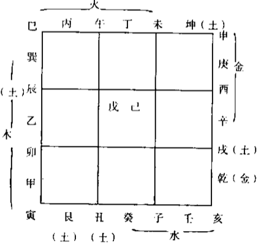

# 干支

```text
天干常用以表达五行之气：甲乙丙丁戊己庚辛壬癸
地支常用以表达时令：子丑寅卯辰巳午未申酉戌亥
气的状态是随时令而更改的
```

### 干支的方位及五行配属
| 干/支 | 时令 | 方位 | 五行 |
| --- | --- | --- | --- |
| 甲乙/寅卯 | 春 | 东 | 木 |
| 丙丁/巳午 | 夏 | 南 | 火 |
| 戊己/辰未戌丑 | 每季末月的末18天 | 中央(辰未上/戌丑下) | 土 |
| 庚辛/申酉 | 秋 | 西 | 金 |
| 壬癸/亥子 | 冬 | 北 | 水 |
```text
时令的依据是节气
```

### 干支阴阳
```text
· 干支：干阳支阴
· 天干：奇数位阳，偶数位阴
· 地支：奇数位阳，偶数位阴
```

### 地支三合局
```text
子年是夜半交冬至，同一时刻交冬至的各年组成三合五行局。要以休囚论的话，就是五行生旺墓的时令。
· 水局：申子辰
· 木局：亥卯未
· 火局：寅午戌
· 金局：巳酉丑
```

### 二十四方位

```text
这种图首先要分清南北，这张是上南下北的
以上是正五行，原点在子
中针五行的原点在正五行的壬子中间
缝针五行的原点在正五行的子癸之间
```