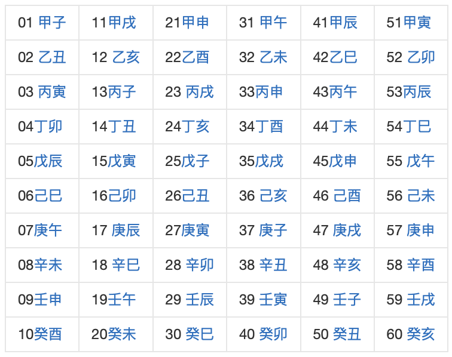
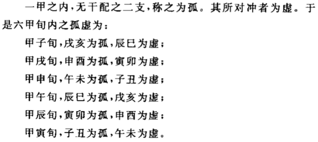

# 六十甲子

```text
十干十二支，让天干循环与地支按次序搭配，每轮多出俩地支，天干共需循环五轮，共六十个组合，称“六十花甲子”。
```


### 六十甲子五行配属（纳音五行）
```text
甲子、乙丑——海中金，丙寅、丁卯——炉中火。
戊辰、己巳——大林木，庚午、辛未——路旁土。
壬申、癸酉——剑锋金，甲戌、乙亥——山头火。
丙子、丁丑——涧下水，戊寅、己卯——城头土。
庚辰、辛巳——白蜡金，壬午、癸未——杨柳木。
甲申、乙酉——泉中水，丙戌、丁亥——屋上土。
戊子、己丑——霹雳火，庚寅、辛卯——松柏木。
壬辰、癸巳——长流水，甲午、乙未——沙中金。
丙申、丁酉——山下火，戊戌、己亥——平地木。
庚子、辛丑——壁上土，壬寅、癸卯——金箔金。
甲辰、乙巳——覆灯火，丙午、丁未——天河水。
戊申、己酉——大驿土，庚戌、辛亥——钗钏金。
壬子、癸丑——桑柘木，甲寅、乙卯——大溪水。
丙辰、丁巳——沙中土，戊午、己未——天上火。
庚申、辛酉——石榴木，壬戌、癸亥——大海水。
```

### 六甲孤虚
```text
· 按照甲子对的组合方式，每一轮天干都会多出两个地址，这多出来的俩称"孤"，其在二十四方位上正对面的支，称"虚"。
· 两军对战或谈判，坐孤击虚，根据人数分别使用年、月、日、时孤虚。如乙丑年位于甲子旬，则戌亥孤，辰巳虚。
· 占卜中亦称空亡，它本身不定吉凶，但影响吉凶结果。占吉逢空亡则吉无，占凶逢空亡凶亦去。
· 《虎铃经·孤虚第一百十七》中有相关描述。
```
