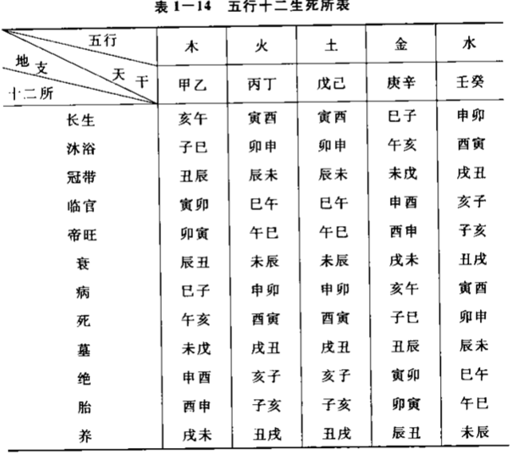
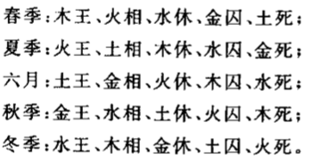
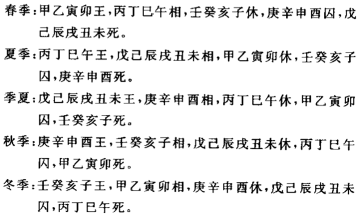
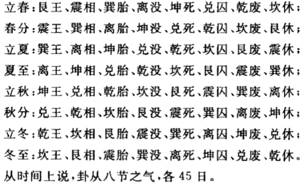

# 休囚

### 生旺死绝
```text
    定出十二种状态以表达随时间由生至死的过程。只有处于渐盛渐衰过程中的状态时，被表达者才是真实存在的。其中渐盛过程的状态统称阳，渐衰过程的状态统
称阴。只有“长生、临官、帝旺、衰、墓”这五种状态被称之为“有用”。

      | 阳                        | 阴           |
不存在 | 渐盛                |盛极  | 渐衰         |不存在
胎、养 | 长生、沐浴、冠带、临官 | 帝旺 | 衰、病、死、墓 | 绝

· 胎、养：自无而有的酝酿。
· 长生：萌芽初长。
· 沐浴、冠带：初生幼稚，气渐生长，犹如登场前的穿衣准备。
· 临官（禄）：人值壮年，锐气正盛。
· 帝旺：极旺之时，由盛转衰的临界，但仍处于旺时，盛气已竭，此后开始转衰。
· 衰、病、死：逐渐衰退的过程，力量递减。
· 墓：死后仍留存余气。
· 绝：彻底没了。
```


### 五行论休囚


### 干支论休囚


### 八卦论休囚
